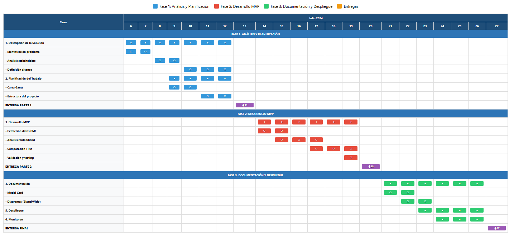

```{r setup, include=FALSE}
knitr::opts_chunk$set(echo = FALSE, message = FALSE, warning = FALSE)
library(kableExtra)
library(dplyr)
```

# Resumen Ejecutivo

El Proyecto Análisis de Inversiones desarrolla una **solución automatizada integral** para optimizar las decisiones de inversión de una compañía de seguros. El sistema implementa análisis comparativo continuo con la **Tasa de Política Monetaria (TPM)** como benchmark principal, incorporando extracción directa desde el portal CMF y un módulo especializado de monitoreo de diferencias temporales.

## Objetivo Principal

Optimizar decisiones de inversión mediante análisis automatizado comparativo con TPM mediante la implementación de un sistema robusto que integra múltiples metodologías de análisis financiero y garantiza el cumplimiento regulatorio con la CMF.

## Características Técnicas Destacadas

- **Extracción Directa CMF**: Obtención automática de datos financieros actualizados
- **Monitoreo Diferencias Temporales**: Detección de correcciones posteriores en datos
- **Comparación Automática TPM**: Benchmark continuo con tasa de política monetaria
- **Análisis Multimetodológico**: Implementación de diferentes metodologías complementarias
- **Sistema de Alertas**: Notificación automática de inconsistencias
- **Dashboard Interactivo**: Visualización en tiempo real
- **Cumplimiento Regulatorio**: Adherencia automática a normativas CMF
- **Alcance**: 50 instrumentos financieros
- **Precisión Objetivo**: 100%

\newpage

# Cronograma y Fases del Proyecto

El proyecto se estructura en **8 fases secuenciales** que culminan con un sistema operativo completo:

## Flujo de Proceso del Sistema


## Fases de Desarrollo

**PASO 1: Definición de Requerimientos**
- Análisis de necesidades de inversión de la compañía de seguros
- Configuración del entorno R para el desarrollo
- Investigación de fuentes de datos de la CMF

**PASO 2: Extracción de Datos**
- Extracción directa desde el portal CMF en tiempo real
- Obtención de datos TPM del Banco Central
- Implementación del sistema de monitoreo de diferencias temporales

**PASO 3: Validación y Procesamiento**
- Validación y limpieza automática de datos
- Detección de diferencias temporales en los datos CMF
- Control de calidad y consistencia

**PASO 4: Análisis Financiero**
- Cálculos de rentabilidad básicos
- Implementación de métricas avanzadas (VaR, CVaR)
- Análisis de correlaciones y comparación con TPM

**PASO 5: Análisis Alternativo**
- Implementación de múltiples metodologías de análisis
- Análisis fundamental, técnico y cuantitativo
- Simulaciones Monte Carlo para evaluación de riesgos

**PASO 6: Visualización y Dashboard**
- Desarrollo de dashboard interactivo
- Sistema de alertas para inconsistencias temporales
- Gráficos en tiempo real y reportes automáticos

**PASO 7: Automatización de Reportes**
- Generación automática de reportes PDF
- Creación de diagramas de Gantt
- Análisis de riesgos y reportes ejecutivos

**PASO 8: Despliegue y Monitoreo**
- Documentación técnica completa
- Manual de usuario para stakeholders
- Sistema de monitoreo continuo y plan de despliegue

El flujo culmina con un **sistema operativo completo** que optimiza las decisiones de inversión mediante comparación automática con la TPM y cumple con las regulaciones de la CMF.

## Diagrama de Gantt del Proyecto



\newpage

# Stakeholders e Impactos

El proyecto involucra múltiples stakeholders con impactos específicos y frecuencia de interacción **semanal** para garantizar un seguimiento efectivo:

```{r stakeholders-table}
stakeholders_data <- data.frame(
  Stakeholder = c('Gerencia de Inversiones', 'Analistas Financieros', 'Comité de Inversiones', 'CMF'),
  Impacto = c('Decisiones estratégicas de inversión', 'Evaluación diaria de oportunidades', 'Reportes ejecutivos y seguimiento', 'Supervisión regulatoria y cumplimiento'),
  Frecuencia = c('Semanal', 'Semanal', 'Semanal', 'Semanal'),
  Modulos_Utilizados = c('Alertas, Dashboard Principal', 'Análisis Comparativo, Diferencias Temporales', 'Reportes Automáticos, Métricas Avanzadas', 'Extracción Directa, Validación Regulatoria')
)
kable(stakeholders_data, 
      caption = 'Stakeholders, Impactos y Módulos Utilizados', 
      booktabs = TRUE, 
      longtable = TRUE) %>%
  kable_styling(latex_options = c('striped', 'repeat_header'), 
                font_size = 9) %>%
  column_spec(1, width = '2cm') %>%
  column_spec(2, width = '4cm') %>%
  column_spec(3, width = '1.5cm') %>%
  column_spec(4, width = '4cm')
```

\newpage

# Análisis de Riesgos y Mitigación

Se identifican los principales riesgos del proyecto con sus estrategias de mitigación correspondientes:

```{r risk-analysis-table}
risk_data <- data.frame(
  Riesgo = c('Inconsistencias en datos CMF', 'Cambios en estructura web CMF', 'Latencia en actualización TPM', 'Calidad de datos históricos', 'Cambios regulatorios', 'Rendimiento del sistema'),
  Probabilidad = c('Alta', 'Media', 'Media', 'Alta', 'Media', 'Baja'),
  Impacto = c('Alto', 'Muy Alto', 'Alto', 'Alto', 'Muy Alto', 'Medio'),
  Estrategia_Mitigacion = c('Módulo diferencias temporales automático', 'Múltiples métodos de extracción alternativos', 'Cache inteligente con sistema de alertas', 'Validación cruzada automática continua', 'Monitoreo normativo y adaptación rápida', 'Optimización código y paralelización')
)
kable(risk_data, 
      caption = 'Análisis de Riesgos y Estrategias de Mitigación', 
      booktabs = TRUE, 
      longtable = TRUE) %>%
  kable_styling(latex_options = c('striped', 'repeat_header'), 
                font_size = 9) %>%
  column_spec(1, width = '3cm') %>%
  column_spec(2, width = '2cm') %>%
  column_spec(3, width = '2cm') %>%
  column_spec(4, width = '5cm')
```

\newpage

# Módulos CMF y Procesamiento de Datos

El sistema implementa módulos especializados para la extracción y procesamiento de datos desde la CMF con frecuencia **semanal**:

```{r cmf-modules-table}
cmf_modules_data <- data.frame(
  Modulo = c('Extracción Directa CMF', 'Monitoreo Diferencias Temporales', 'Validación Regulatoria', 'Sistema de Alertas'),
  Funcion_Principal = c('Obtener datos financieros actualizados', 'Detectar correcciones posteriores en datos', 'Verificar cumplimiento límites inversión', 'Notificar inconsistencias y errores'),
  Fuente_Datos = c('Portal Oficial CMF', 'Base Histórica CMF', 'Normativa Actualizada CMF', 'Comparación Cruzada CMF'),
  Frecuencia_Ejecucion = c('Semanal', 'Semanal', 'Semanal', 'Semanal')
)
kable(cmf_modules_data, 
      caption = 'Módulos CMF y Frecuencia de Ejecución', 
      booktabs = TRUE, 
      longtable = TRUE) %>%
  kable_styling(latex_options = c('striped', 'repeat_header'), 
                font_size = 9) %>%
  column_spec(1, width = '3cm') %>%
  column_spec(2, width = '4cm') %>%
  column_spec(3, width = '2.5cm') %>%
  column_spec(4, width = '2cm')
```

\newpage

# Metodologías de Análisis Financiero

El sistema integra **múltiples metodologías complementarias** de análisis financiero para garantizar robustez en las decisiones de inversión:

```{r analysis-methods-table}
analysis_methods_data <- data.frame(
  Metodologia = c('Análisis Fundamental', 'Análisis Técnico', 'Análisis Cuantitativo', 'Simulación Monte Carlo', 'Modelo Black-Litterman', 'Análisis Factorial', 'Análisis de Regímenes de Mercado'),
  Descripcion = c('Evaluación del valor intrínseco de activos', 'Análisis de patrones en precios históricos', 'Modelos matemáticos y estadísticos', 'Simulación de múltiples escenarios', 'Optimización bayesiana de portafolios', 'Descomposición de factores de retorno', 'Identificación de estados del mercado'),
  Ventajas_Principales = c('Visión fundamental a largo plazo', 'Señales precisas de entrada y salida', 'Objetividad y escalabilidad', 'Análisis robusto de riesgos', 'Incorporación de views del mercado', 'Identificación de drivers de retorno', 'Adaptabilidad a cambios de mercado'),
  Aplicacion_Practica = c('Evaluación acciones y bonos', 'Trading de instrumentos líquidos', 'Optimización portafolios complejos', 'Proyecciones VaR y stress testing', 'Asignación estratégica de activos', 'Atribución de performance', 'Asignación táctica dinámica')
)
kable(analysis_methods_data, 
      caption = 'Metodologías de Análisis Financiero Implementadas', 
      booktabs = TRUE, 
      longtable = TRUE) %>%
  kable_styling(latex_options = c('striped', 'repeat_header'), 
                font_size = 8) %>%
  column_spec(1, width = '2.5cm') %>%
  column_spec(2, width = '3cm') %>%
  column_spec(3, width = '3cm') %>%
  column_spec(4, width = '3cm')
```

\newpage

# Conclusiones y Próximos Pasos

## Beneficios Esperados

- **Optimización de Decisiones**: Comparación automática y continua con TPM
- **Cumplimiento Regulatorio**: Adherencia automática a normativas CMF
- **Detección Temprana**: Identificación de inconsistencias temporales
- **Análisis Robusto**: Múltiples metodologías complementarias
- **Eficiencia Operativa**: Automatización de procesos manuales
- **Visibilidad Ejecutiva**: Dashboard y reportes automáticos

## Sistema Operativo Completo

El resultado final es un **sistema operativo completo** que:

- Integra datos CMF y TPM en tiempo real
- Detecta diferencias temporales automáticamente
- Aplica múltiples metodologías de análisis
- Genera alertas y reportes automáticos
- Cumple con regulaciones CMF para seguros
- Optimiza continuamente las decisiones de inversión

## Impacto Organizacional

La implementación del sistema permitirá a la compañía de seguros tomar decisiones de inversión más informadas, reducir riesgos regulatorios y mejorar la rentabilidad de sus productos, beneficiando directamente a todos los stakeholders identificados.


